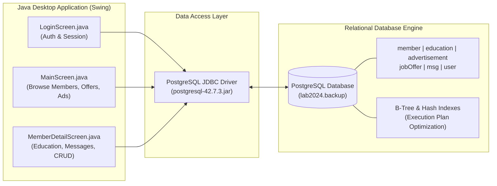

# Professional Network Database System — PostgreSQL & Java JDBC Client

[](https://www.postgresql.org/)
[](https://www.oracle.com/java/)
[](https://jdbc.postgresql.org/)
[](https://en.wikipedia.org/wiki/SQL)
[](https://docs.oracle.com/javase/tutorial/uiswing/)

A complete database engineering project featuring **relational schema design, complex analytical SQL queries, B-Tree vs. Hash index benchmarking on PostgreSQL, and a multi-screen Java Swing management desktop client connected via JDBC**.

---

## System Architecture



---

## Domain & Data Modeling

The schema models an enterprise **professional networking platform** (similar to LinkedIn):
- **`user` & `member`:** Authentication credentials, profile information, contact metadata, and professional summary.
- **`education`:** Academic records, university affiliations, degrees, fields of study, and countries (foreign key relationship with members).
- **`advertisement` & `jobOffer`:** Published job postings, criteria (age range, qualifications, requirements), posting dates, and poster references.
- **`msg`:** Direct messaging network capturing communication graphs, timestamps, sender/receiver references, and subject content.

---

## Key Features & Engineering Highlights

### 1. Indexing & Query Optimization Study
Located in [`sql/queries_and_benchmarks.sql`](file:///C:/Users/stath/Downloads/portfolio-assets/uni-database/sql/queries_and_benchmarks.sql), the project evaluates performance tuning on high-cardinality tables:
- **B-Tree vs. Hash Index Benchmarks:** Empirical speed comparisons on range searches (`jobOffer.fromAge`, `advertisement.datePosted`) vs. exact equality lookups (`education.country`, `member.email`).
- **Execution Plan Analysis:** Profiling sequential scans vs. index scans using `EXPLAIN ANALYZE`.
- **Parallel Worker Optimization:** Investigating query overheads with worker controls (`SET max_parallel_workers_per_gather`).

### 2. Java Swing Management Desktop Client
Located in [`src/netapp/`](file:///C:/Users/stath/Downloads/portfolio-assets/uni-database/src/netapp):
- **`LoginScreen.java`:** Secure administrator and member authentication gate.
- **`MainScreen.java`:** Interactive tabular interface displaying members, search queries, filterable lists, and quick navigation.
- **`MemberDetailScreen.java`:** Deep inspection of profile details, linked educational records, and messaging histories.
- **`Member.java` & `User.java`:** Strongly typed domain models encapsulating relational records.

---

## Getting Started

### Prerequisites
- [PostgreSQL](https://www.postgresql.org/download/) (v14+)
- [Java Development Kit (JDK 17+)](https://adoptium.net/)

### 1. Database Restoration
Create a PostgreSQL database and restore the backup file:
```bash
# Create target database
createdb -U postgres lab2024

# Restore from backup
pg_restore -U postgres -d lab2024 database/lab2024.backup
```

### 2. Compiling & Running the Java Application
```bash
# Navigate to project root
cd uni-database

# Compile Java source files
javac -cp "lib/postgresql-42.7.3.jar" -d bin src/netapp/*.java

# Launch the desktop application
java -cp "bin;lib/postgresql-42.7.3.jar" netapp.LoginScreen
```
*(On Linux/macOS, use colon separator: `-cp "bin:lib/postgresql-42.7.3.jar"`)*

---

## Repository Structure

```text
uni-database/
├── database/
│   └── lab2024.backup               # Full PostgreSQL database backup
├── docs/
│   └── Database_System_Report.pdf   # Architectural design & ER specifications
├── lib/
│   └── postgresql-42.7.3.jar        # PostgreSQL Type 4 JDBC Driver
├── sql/
│   └── queries_and_benchmarks.sql   # Index benchmark scripts & analytical queries
└── src/
    └── netapp/
        ├── LoginScreen.java         # Authentication GUI
        ├── MainScreen.java          # Member browser & search GUI
        ├── MemberDetailScreen.java  # Member profile & relational viewer
        ├── Member.java              # Entity data model
        └── User.java                # Authentication model
```

---

## Author & Academic Affiliation

**Dimitris Stathoulias**  
School of Electrical & Computer Engineering (ECE), Technical University of Crete (TUC)  
- **GitHub:** [@dstathoulias](https://github.com/dstathoulias)  
- **Email:** [stath.jim2000@gmail.com](mailto:stath.jim2000@gmail.com)
